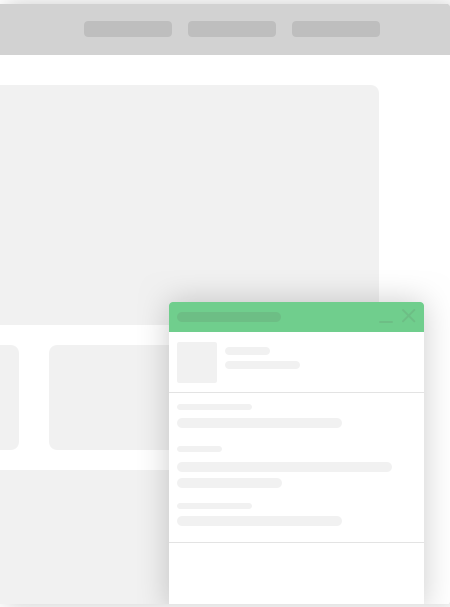


.. include:: ../Includes.txt

============
Introduction
============

ext:ns_all_chat
===================

.. _What-does-it-do:

What does it do?
================

One of the only TYPO3 extension which provides to use most popular chat tool at your website. This TYPO3 extension provides to configure many live chat tools eg., `zopim.com <https://en.zopim.com/register>`_, `livechatinc.com <https://accounts.livechatinc.com/signup/credentials>`_, `purechat.com <https://www.purechat.com/>`_, `livezilla.net <https://www.livezilla.net/installation/en/>`_, `clickdesk.com <https://www.clickdesk.com>`_ , `tidiochat.com <https://www.tidiochat.com/en/register>`_, `visitlead.com <https://visitlead.com/register>`_, `onwebchat.com <https://www.onwebchat.com/signup.php>`_, `userlike.com <https://www.userlike.com/en/>`_ & more will be available in an upcoming version.

.. _Screen-shots:

Screen Shots
================

Most popular live chat tools which we provides in this extension
----------------------------------------------------------------

Sample: Backend of your chat site
-------------------------

Sample: Frontend of your site
---------------------

